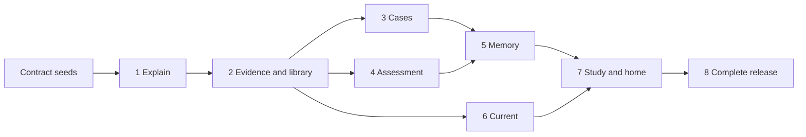

# Renulus stages and worktree ownership review

Planning judgement · 2026-10-04 · Input to the parent's consolidated plan.

**Consolidation status:** the [implementation plan](../../planning/IMPLEMENTATION_PLAN.md),
[architecture](../../planning/ARCHITECTURE.md) and [parallel-work rules](../../planning/PARALLEL_WORK.md)
are authoritative. The alternative stage/module numbering below is retained as
review input, not a second implementation plan. Upstream findings are now recorded
in the [Hermes investigation](hermes-adoption.md).

The latest instruction confirms all seven round-3 recommendations and the Hermes fork direction, superseding unresolved wording in the [decision queue](../../planning/DECISION_QUEUE.md). Assume a retained local agent runtime behind a small controlled interface; upstream identity, integration and capabilities await the other investigations. Supermemory remains unadopted. Nothing below is implemented or tested. Only this note is written.

**Delivery order.** These are cumulative working product stages, not module completion milestones. Each adds usable behaviour to the installed Windows application. Preserve upstream execution, conversation orchestration and supported tooling wherever verified suitable; Renulus owns educational rules and records. Do not rebuild those runtime facilities.

Use the exact [subscription/model allowlist](../../DECISIONS.md), without owner hosting, inference hosting, training, paid API fallback or substitute models. Stage acceptance involving subscriptions requires later authorised verification; this research makes no provider calls. An unavailable required capability blocks its stage rather than producing a simulated pass.

Every stage supports the whole topic map. Acceptance rotates through AKI, CKD, glomerular disease, dialysis, transplantation and electrolytes, including mixed-topic examples. These are test samples, not scope limits. Content breadth grows in parallel from stage 1.

| Stage | Minimum dependencies | Observable output and acceptance |
| --- | --- | --- |
| 1. Working explanation | Verified runtime/subscription integration | Install and launch on a clean supported Windows PC. Choose any topic; receive streamed direct Explain with optional guided teaching. Actually interpret typed text, a PDF passage/table and an image; inspect the cited input location. Exercise cancellation, unavailable capability, automatic permitted-model selection and manual override without subscription switching. Enforce retention policy immediately. |
| 2. Evidence and reusable library | 1 | Add eligible material explicitly to a personal library; reopen and retrieve a passage in another conversation. Preserve source edition, page/figure locator, access date and operation-specific use status. Automatic evidence lookup opens actual sources; changed, missing and offline sources produce accurate freshness states. Verify scanned-PDF and image extraction against synthetic originals, including units. |
| 3. Case learning | 1–2 | Discuss entered daily-practice and reviewed staged teaching cases; reveal findings, explain reasoning and inspect debrief sources. Unsaved entered cases disappear on closing/restarting; explicit Save permits resume with attachments. Inspect application-controlled runtime history, logs, extraction caches and indexes to establish that unsaved raw material was not retained. |
| 4. Assessment and practice | 2 | Complete a mixed-domain reviewed-bank test and separate labelled generated practice. Commit answers before feedback; score deterministically against immutable bank/item/key versions. Interrupted attempts resume without duplicate scoring. Assistance and repeats remain distinguishable; tutoring cannot retrieve reserved assessment answers. Publish and link a correction without silently rewriting earlier attempts. |
| 5. Editable learning continuity | 3–4 | Automatically capture deduplicated learning takeaways, preferences and evidence-linked progress. Correct/delete/export records; rebuild summaries and recommendations without deleted content reappearing. Replaying evidence does not duplicate progress. Case-derived memory contains generic learning only; discussing a topic does not establish competence. |
| 6. Staying current | 2 | Retrieve guidelines and selected research; show publication, revision and last-successful-check dates with review status. Open evidence, compare versions and mark read/save. A failed lookup never advances the checked-through date. Queries contain topics, not case details; draft/preprint status remains visible. |
| 7. Coherent study home | 3–6 | Ask, Resume, suggested review and relevant updates all open working destinations. Goals, optional exam date, study time and observed mistakes produce an editable adaptive plan across general topics and ESENeph. Free exploration remains available. Resume honours case retention; deleting evidence recalculates dependent recommendations. |
| 8. Complete release | 1–7 | Close every required cell in the approved topic/ESENeph coverage matrix with reviewed content and runnable journeys; expose actual bank coverage. Verify clean installation, upgrade, backup/restore, export/deletion, keyboard access, scaling, interruption and all three input formats across domains. Record verified capabilities per offered subscription/model; mocks and upstream feature lists cannot establish release readiness. |

**Vertical ownership.** Seven long-lived modules span several stages. Each owns its UI, implementation, authoritative records, migration proposals and colocated `tests/` and synthetic `fixtures/`. Callers cross a small interface, never write another module's tables.

| Module | Exclusive proposed paths | Owns |
| --- | --- | --- |
| Study | `renulus/modules/study/` | Topic/exam mappings, goals, plan, home composition, resume references |
| Explain | `renulus/modules/explain/` | Study threads, direct/guided teaching, follow-ups |
| Cases | `renulus/modules/cases/` | Case runs, staged facts, reasoning, Save and ephemeral lifecycle |
| Assessment | `renulus/modules/assessment/` | Attempts, commitment, scoring, assistance, generated practice |
| Memory | `renulus/modules/memory/` | Canonical takeaways, preferences, evidence ledger, derived progress |
| Current | `renulus/modules/current/` | Update entries, comparisons, check/read/saved state |
| Sources | `renulus/modules/sources/`, `renulus/content/` | Import/extraction, library, retrieval, permissions, immutable reviewed source/bank/case editions |

One integration owner controls `renulus/platform/`, `renulus/contracts/`, `renulus/migrations/`, `renulus/tests/e2e/`, root manifests/lockfiles, packaging and shared Figma-derived controls/tokens. That owner also controls changes inside retained upstream directories, whose layout should remain intact. These paths are proposals, not folders to create now. Sources publishes reviewed keys/content; Assessment owns scoring behaviour. Maintainer review remains the user-and-assistant workflow.

**Interface and schema order.** First merge stable topic/session/source/content IDs, retention classes, cancellation/errors and the runtime request policy enforcing subscription, allowlist and permitted tools. Retention class propagates through prompts, derived text and handoffs. Then integrate source-version/passages and eligibility contracts; next bank versions, answer commitment and idempotent learning-evidence events, including assistance. Finally integrate memory revisions/deletion, plan inputs and update freshness. Consumers use typed interfaces such as retrieve eligible passages, submit answer, record evidence and resume session. Avoid a general autonomous-agent interface that can bypass scoring or storage rules.

The integrator serialises the migration ledger; module owners supply namespaced changes. Published editions remain immutable. Use additive changes first, migrate/backfill with validation, then remove obsolete fields only after consumers move. Capture evidence reliably with its originating attempt; delivery retries must remain idempotent.

**Dependency waves.** Stages 3, 4 and 6 can proceed concurrently after 2. Content expansion starts with stage 1 and continues throughout. Contract-only work is a prerequisite, never advertised as a working product stage.

**Worktree policy: source facts and judgement.** Git documents separate worktree HEAD/index but shared refs and default repository configuration. [Git worktree manual](https://git-scm.com/docs/git-worktree), accessed 2026-10-04. Engineering inference: runtime isolation must be configured separately.

Propose sibling worktrees `../Renulus-wt-<owner>/` with unique `plan-impl/<owner>-<slice>` branches from an agreed integration commit. Keep the sole `origin` pointing to `houraniiiii/Renulus`; record upstream revision/provenance without adding a remote. No worktrees or branches are created here.

Each worktree/run receives `.local/dev/<worktree-id>/<run-id>/` containing isolated runtime, profile, database, caches, temporary attachments, logs and outputs, plus unique ports, named pipes and mutexes. Copy only synthetic fixture seeds into writable test state. Explicit state paths must reach subprocesses; fail if the retained runtime falls back to personal/global profiles. Do not copy credentials. Offline test adapters isolate development; later real-runtime acceptance remains mandatory.

Reserve shared-path changes with the integration owner; no opportunistic lockfile regeneration or cross-owner edits. Integrate one reviewed slice at a time into a clean dedicated worktree; never stash/reset someone else's changes. Git warns merge abort may not reconstruct pre-existing edits. [Git merge manual](https://git-scm.com/docs/git-merge), accessed 2026-10-04. Resolve semantic conflicts jointly, rerun affected interface/migration tests, then the combined synthetic Windows journey. Test simultaneous worktrees for state leakage. Record commit, fixture versions and results; retain failed evidence. Rebase only unpublished owned branches by agreement.

**Contradictions and decisions.** Resume applies to saved sessions; unsaved cases are the explicit exception. Generic case takeaways must exclude raw narratives, identifiers, attachments and recoverable quotations. Local non-persistence cannot promise provider-side deletion. Propose editable ordinary study history for Resume, with case classification before input, rather than silently claiming all transcript retention is confirmed. Reconcile the older framework-first plan with runtime reuse in the parent's document. No additional major user decision is necessary for this decomposition; runtime capability and retention incompatibilities are evidence gates for engineering, not a technical-choice questionnaire.
